# 🔒 Automating IaC security scanning on AWS with Terraform
## Modelo de referencia: Automatización de seguridad para AWS con Terraform

[](#)
[](#)
[](#)
[](https://conventionalcommits.org)

> 🚀 Fortalece la postura de seguridad en AWS mediante la implementación de Shift Left Security. Este repositorio automatiza el análisis estático y la validación de políticas en el código de Terraform, interceptando configuraciones riesgosas antes de que impacten en el aprovisionamiento real.

## 📍 Índice de contenido

- [Objetivos](#local-01)
- [Escenarios de seguridad](#local-02)
- [Clasificación de análisis de IaC](#local-03)
    * [Fase 1: Análisis Estático (SAST)](#local-03-01)
    * [Fase 2: Análisis Dinámico (DAST)](#local-03-02)
- [Herramientas de inspección](#local-04)
- [Estructura del proyecto](#local-05)
- [Ciclo de vida de prueba (Workflow)](#local-06)
    * [Flujo de verificación de vulnerabilidades manual en **`GitHub Actions`**](#local-06-01)
- [Automatización de Workflow local con Makefile](#local-07)
    * [Estructura de comandos](local-07-01)
    * [Parámetros opcionales](#local-07-02)
    * [Ejemplos de uso](#local-07-03)
- [Guía de ejecución](#local-08)
    * [1. Validar la conexión segura con AWS](#local-08-01)
    * [2. Ejecución del análisis estático (SAST) aplicado a IaC](#local-08-02)
    * [3. Verificar resultados del análisis de vulenrabilidades del código de Terraform para AWS](#local-08-03)
    * [4. ¿Cómo interpretar el reporte de seguridad?](#local-08-04)
    * [5. Manejo de fallos en el Pipeline](#local-08-05)
    * [6. ¿Cómo omitir (Skip) reglas en el código?](#local-08-06)
* [Guía de remediación de hallazgo](#local-09)
* [Conclusiones](#local-10)

---

## 🎯 Objetivos <a name="local-01"></a>
* El propósito principal de este proyecto es demostrar la efectividad del Análisis Estático de Vulnerabilidades (SAST) aplicado a la infraestructura, asegurando que los recursos de nube cumplan con los estándares de seguridad antes de su creación.
* Implementar un pipeline automatizado de seguridad que identifique y reporte configuraciones riesgosas en código de Terraform para AWS, reduciendo la superficie de ataque de la infraestructura.
    * - **Automatizar el escaneo de seguridad:** Integrar Checkov en GitHub Actions para que cada cambio en la infraestructura sea evaluado de forma autónoma.
    * **Estandarizar el reporte de hallazgos:** Utilizar el formato `SARIF` para visualizar vulnerabilidades directamente en la interfaz de GitHub, facilitando la lectura para el equipo de **`Cloud Engineer`**.
    * **Fomentar la cultura "Shift Left Security":** Detectar errores de configuración (como buckets públicos o puertos abiertos) en la fase de codificación, evitando despliegues inseguros en entornos de producción.

---

## 🛡️ Escenarios de seguridad y alcance <a name="local-02"></a>
* El alcance de este análisis se centra en la evaluación de archivos de configuración de Terraform destinados a desplegar recursos en Amazon Web Services (AWS).

* El pipeline de validación inspecciona el código buscando mitigar los siguientes riesgos comunes en infraestructuras AWS:<br>

    * **Exposición de Datos:** Verificación de buckets S3 con acceso público, falta de cifrado o ausencia de políticas de bloqueo de acceso público.
    * **Gestión de Identidades (IAM):** Identificación de roles con privilegios excesivos (AdminAccess), uso de comodines (*) en políticas y falta de rotación de credenciales.
    * **Seguridad de Red:** Detección de Security Groups con reglas de ingreso demasiado permisivas (ej. puertos 22 o 3389 abiertos a 0.0.0.0/0).
    * **Cifrado y Secretos:** Escaneo de recursos (EBS, RDS, KMS) sin cifrado activo y detección de secretos (llaves de API, passwords) embebidos en el código.

---

## 🔍 Clasificación de análisis de IaC <a name="local-03"></a>
Para automatizar la detección de riesgos, existe un enfoque de defensa en profundidad, dividido en dos fases críticas del ciclo de vida del código. En la prueba estaré usando la Fase 1 y dejaremos como mejora la implementación de la Fase 2:

### Fase 1: Análisis Estático (Static Analysis / SAST) <a name="local-03-01"></a>
- **Momento:** Se ejecuta sobre el código fuente (.tf) antes de cualquier interacción con la nube. Analizan el código fuente (.tf) sin necesidad de interactuar con AWS o generar un plan.
- **Alcance:** Evalúa la sintaxis y las configuraciones declaradas frente a un conjunto de políticas predefinidas (ej. Checkov).
- **Ventaja:** Es extremadamente rápido y no requiere credenciales de AWS, permitiendo detectar errores humanos en la fase de codificación.
- **Tools:**<br>
    - **Checkov:** Framework de seguridad basado en políticas que escanea configuraciones en busca de fallos de seguridad y cumplimiento.
    - **Tfsec:** Escáner de seguridad estático especializado en Terraform que utiliza un análisis basado en grafos para encontrar vulnerabilidades.

### Fase 2: Análisis Dinámico del Plan (Plan Validation) <a name="local-03-02"></a>
- **Momento:** Se ejecuta sobre el archivo generado por el comando `terraform plan`. Analiza el archivo binario generado por `terraform plan` para evaluar el impacto real de los cambios.

- **Alcance:** Analiza el estado final que tendría la infraestructura tras combinar el código con los recursos ya existentes en la nube.

- **Ventaja:** Identifica riesgos que solo son visibles cuando se conocen los valores reales que se desplegarán (como direcciones IP finales o dependencias entre recursos).

- **Tools:**<br>
    - **Terraform Compliance:** Herramienta que permite definir reglas de cumplimiento en lenguaje natural (Gherkin) para validar el estado deseado.
    - **OPA (Open Policy Agent) / Rego:** (Opcional/Avanzado) Implementación de Policy-as-Code para definir guardrails personalizados antes del apply.

> [!NOTE]
> * *La Fase 1 es* *`"Shift Left Security`"* *(Seguridad temprana) y la Fase 2 es* *`"Pre-deployment"`*.
> * *Para efectos de este proyecto, nos enfocaremos en la* *`Fase 1 (Análisis Estático)`* *utilizando* *`Checkov`* *integrado en el pipeline de* *`GitHub Actions`*.<br>

---

## 🛠️ Herramientas de inspección (Stack Tecnológico) <a name="local-04"></a>
Este ejercicio se centra en la ejecución de análisis estático mediante **Checkov**. Para ello, se han integrado herramientas que permiten automatizar la seguridad bajo el enfoque de ``Seguridad como Código (SaC)``, garantizando una protección proactiva desde las primeras etapas del desarrollo del código de la infraestructura (IaC).<br>

|Herramienta    | Función Principal                 |	Descripción                     |
|---------------|---------------------------------- |-----------------------------------|
|Terraform	    | Infraestructura como Código (IaC)	| Lenguaje declarativo utilizado para definir y gestionar los recursos de AWS (S3, VPC, IAM) de forma reproducible |
|Checkov	    | Escáner SAST para IaC	            | Herramienta de análisis estático que evalúa las configuraciones de Terraform frente a cientos de políticas de seguridad y cumplimiento (Best Practices) |
|GitHub Actions | Orquestación de CI/CD	            | Plataforma de automatización que ejecuta el pipeline de seguridad de forma consistente ante cada cambio en el código |
|Formato SARIF  | Intercambio de Resultados         | Estándar basado en JSON utilizado para integrar los hallazgos de Checkov directamente en la interfaz visual de GitHub Security Annotations|
|Make / Makefile| Automatización de Comandos        | Scripts de automatización en sistemas Linux/Unix que estandariza la ejecución de los escaneos, permitiendo lanzarlos con comandos simples como make scan-s3|

### ¿Por qué este Stack?
- **Prevención "Shift Left Security":** La combinación de **`Checkov`** con **`GitHub Actions`** permite detectar errores en las fases iniciales del desarrollo del código de la infraestructura (IaC).<br>, mucho antes de que la infraestructura se despliegue en AWS.

- **Visibilidad Centralizada:** Al utilizar el `formato SARIF`, los **`Cloud Engineer`** pueden ver las vulnerabilidades directamente en sus `Pull Requests` sin necesidad de revisar archivos de log externos.

- **Flexibilidad:** El uso de `Terraform` permite que este mismo flujo de seguridad sea escalable a otros proveedores de nube o servicios adicionales.

---

## 📂 Estructura del proyecto  <a name="local-05"></a>
* Para facilitar la navegación y el escaneo modular, el repositorio está organizado por servicios de infraestructura. 
* Esta estructura permite ejecutar pruebas de seguridad de forma aislada o centralizada:

```plaintext
/ (root del repo)
├── .github                      
│   └── workflows                # Pipelines de validación (test OIDC y IaC Security)
├── terraform/                   # El núcleo de IaC
│   ├── sandboxes/               # Creación de recursos efímeros (test,labs,demos)
│   │   ├── iac-security-scans/  # Uso de recursos vulnerables que requiere el test de Seguridad de IaC
│   ├── modules/                 # 📦 Módulos reutilizables
│   │   ├── storage/ 
│   │   │    └── s3-vulnerable/  # Bucket S3 con vulnerabilidades
│   │   └── networking/          
│   │   │    └── security-group/ # Security Group con vulnerabilidades
│   ├── makefiles/               # Scripts para para agilizar tareas comunes (Git,comandos AWS CLI)
│   ├── Makefile                 # Orquestador de comandos
└── README.md                    # Documentación técnica
```

---

## 🔄 Ciclo de vida de prueba (Workflow) <a name="local-06"></a>
* Existen varios tipos de flujos que podemos implementar para aplicar **`Guardrails (controles de seguridad preventivos)`**. 
* La elección dependerá del caso de uso, las necesidades de la empresa o los requerimientos normativos.
* Herramientas de **`CI/CD`**  como **`GitHub Actions`** o incluso flujos locales basados en **`Make (scripts de automatización en sistemas Linux/Unix)`**, nos brindan la flexibilidad necesaria para adoptar distintos enfoques, tales como:<br>
    * El flujo para archivos locales
    * Flujo disparado por **`Push`** o **`Pull Request (PR)`**.
    * Flujo de verificación de vulnerabilidades manual en **`GitHub Actions`**.
* Para los fines de esta guía y proyecto de demostración, utilizaremos el **`Flujo de verificación de vulnerabilidades en GitHub Actions de ejecución manual`**.<br>

> [!NOTE]
> *"El uso de **`Makefiles`** permite que los mismos **`Guardrails (controles de seguridad preventivos)`** ejecutados en el pipeline de **`GitHub Actions`** puedan ser validados localmente por el **`Cloud Engineer`** con un simple comando (ej. make scan), garantizando consistencia."*

### Flujo de verificación de vulnerabilidades manual en **`GitHub Actions`** <a name="local-06-01"></a>
* El flujo de verificación manual permite a los equipos de plataforma y seguridad ejecutar **`guardrails (controles de seguridad preventivos)`** de manera independiente y bajo demanda. 
* Utilizando el evento **`workflow_dispatch`**, lanzamos un análisis estático con **`Checkov`** sobre el estado actual de la infraestructura, permitiendo una visibilidad rápida de las vulnerabilidades sin interferir con los ciclos de integración continua automáticos.
* Este enfoque es especialmente útil para:<br>
    * **Auditorías rápidas:** Validar el cumplimiento de seguridad antes de un despliegue crítico.
    * **Consistencia técnica:** Al invocar los comandos mediante un **`Makefile (herramienta estándar de automatización en Linux)`**, garantizamos que el análisis en la nube sea idéntico al que realizaría un **`Cloud Engineer`** en su terminal local.
    * **Gobernanza:** Proporcionar un mecanismo de control que no depende de un cambio en el código **`(Push/PR)`** para generar un reporte de estado.

1. **Generación de código inseguro:** Se incluyen recursos de AWS con fallos de seguridad deliberados para validar la detección de **`Checkov`** y la generación de reportes.

    ```bash
    # Directorios con recursos vulnerables
    ./terraform/sandboxes/iac-security-scans/storage/s3-vulnerable/
    ./terraform/sandboxes/iac-security-scans/network/sg-vulnerable/
    ./terraform/modules/storage/s3-vulnerable/
    ```

2. **Sincronización con el repositorio remoto:** Utilizamos Make para automatizar tareas. Puedes consultar los comandos disponibles ejecutando:

    ```bash
    cd terrraform
    make # Despliega el menú de ayuda
    ```

    <p align="center">
        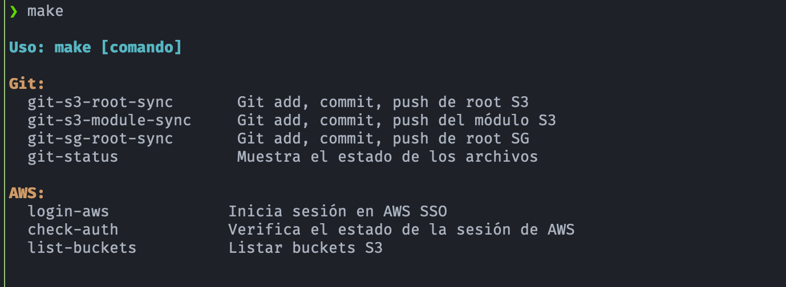
    </p>
  
3. **Ejecución del análisis estático (SAST) de IaC:** El pipeline ejecuta de manera manual el escaneo de seguridad
4. **Auditoría de resultados:** Revisión de los reportes generados en formatos CLI (detallado) y SARIF (visual en GitHub). para identificar las vulnerabilidades detectadas en Terraform.
5. **Revisión y Remediación:** Analizar las **Annotations** y corrigir el código en caso de fallos, reiniciando el ciclo hasta obtener un estado exitoso.

---

## ⚙️ Automatización de Workflow local con Makefile  <a name="local-07"></a>
* Este proyecto incluye un **`Makefile`** para agilizar las tareas comunes de **Git`**. En lugar de ejecutar múltiples comandos.
* Para mantener la consistencia en las actualizaciones del repositorio, utilizamos comandos automatizados que gestionan el flujo de **`Git`** de forma segmentada.

### Estructura de comandos <a name="local-07-01"></a>
El formato es: `make git-[recurso]-[nivel]-sync`

|Comando |Recurso |Nivel |Descripción |
| :--- | :--- | :--- | :--- |
| `git-s3-root-sync` | **S3** | Root | Configuración global y orquestación de buckets |
| `git-s3-module-sync` | **S3** | Module | Ajustes específicos de componentes S3 |
| `git-sg-root-sync` | **SG** | Root | Reglas de red troncales y VPC |

### Parámetros opcionales <a name="local-07-02"></a>
- `GIT_MSG`: Mensaje del commit (si se omite, el sistema aplica uno por default).
- `GIT_BRANCH`: Rama destino (por defecto `main`).
- `GIT_FILE`: Archivo(s) a incluir (por defecto `.` para incluir todo el directorio).

### Ejemplos de uso <a name="local-07-03"></a>
- Commit rápido (valores por defecto)

    ```bash
    cd terraform
    make git-s3-root-sync
    ```

- Commit con mensaje personalizado:
    ```bash
    cd terraform
    make git-s3-root-sync GIT_MSG="docs(readme): update automation guide"
    make git-sg-module-sync GIT_MSG="feat: open port 443 for alb"
    ```

    <p align="center">
        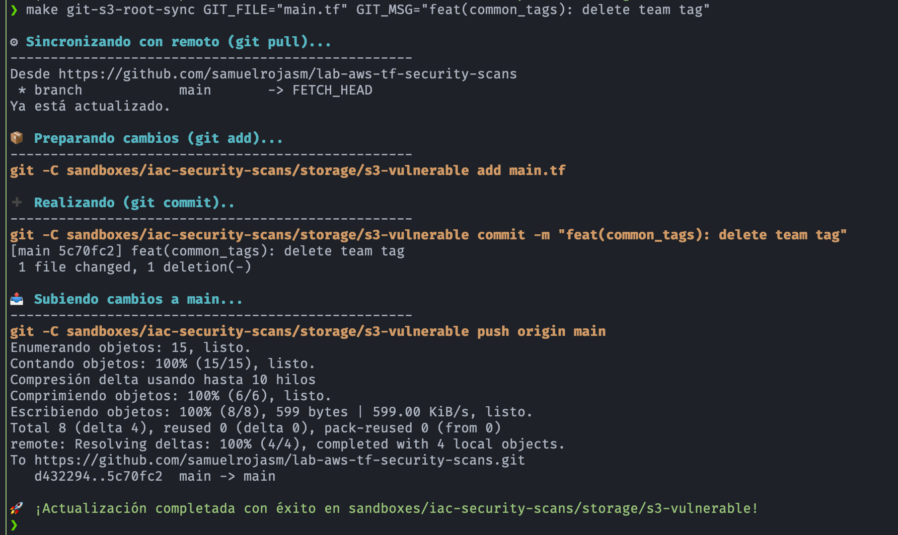
    </p>

- Subir un archivo específico a otra rama:

    ```bash
    cd terraform
    make git-s3-root-sync GIT_FILE="main.tf" GIT_BRANCH="develop"
    ```
    
---

## 🚀 Guía de ejecución <a name="local-08"></a>
### 1. Validar la conexión segura con AWS  <a name="local-08-01"></a>
Esta fase nos sirve para validar la configuración de seguridad de GitHub Identity Provider (IdP).

**1. Pre-requisito: Crear un "Repositiory secret"**
- Esta configuración se crea o valida en las opciones del repositorio: 
    ```bash
    Settings ➡️ Security ➡️ Secrets and varibales ➡️ Actions 
    ```

- En este repositorio el **"Repositiory secret"** contiene el **Amazon Resource Name (ARN)** del rol de AWS, necesario para que GitHub asuma este rol y se pueda realizar la conexión segura con AWS usando OIDC.<br>
   - En este repositorio el "Repositiory secret" se llama **AWS_ROLE_ARN**

        <p align="center">
            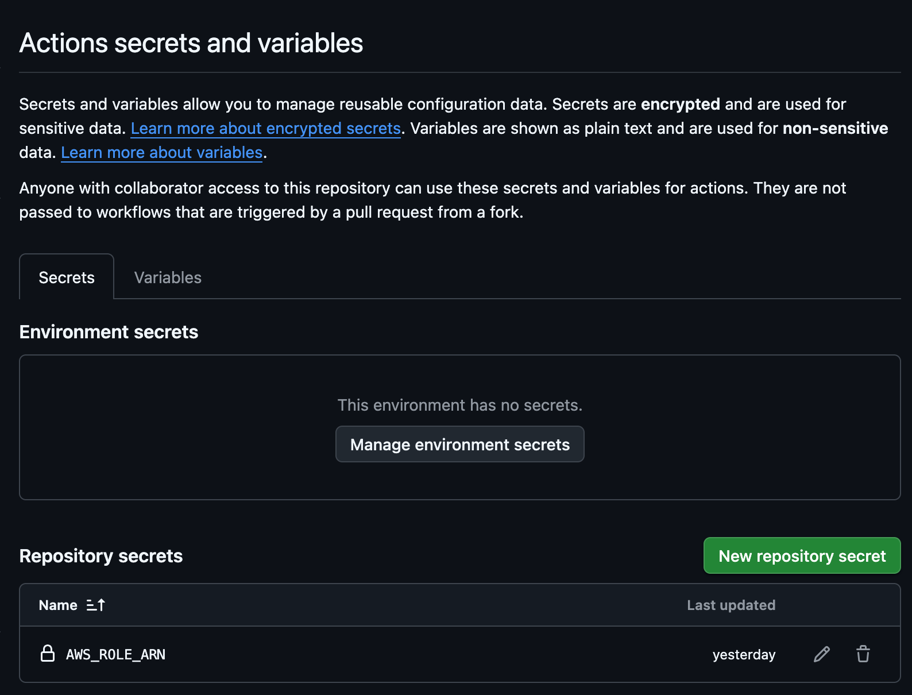
        </p>

**2. Ejecutar la pueba de conexión segura con AWS**
- Para realizar la prueba vamos al archivo **`.github/workflows/test-oidc.yml`** de este repositorio
- Seleccionar el botón **"View Runs"** que nos manda a la sección **"Actions"**
- En la sección **"Actions"** seleccionamos el menu desplegable **"Run workflow"** y después el botón **"Run workflow"**

    <p align="center">
        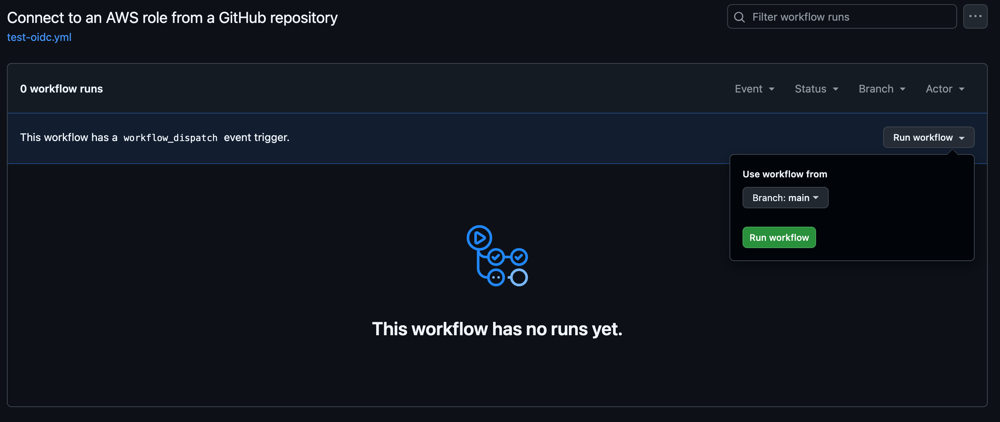
    </p>

- Al terminar el workflow debe de mostrar que terminó con éxito (indicador en color verde)

    <p align="center">
        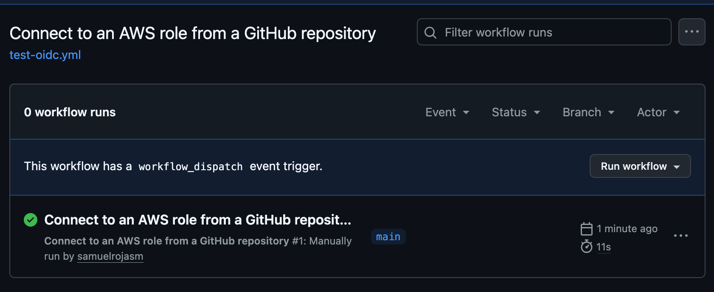
    </p>

- Para visualizar el estado del **Job** ejecutado presionamos sobre el nombre del workflow y nos abre el listado de Jobs:

    <p align="center">
        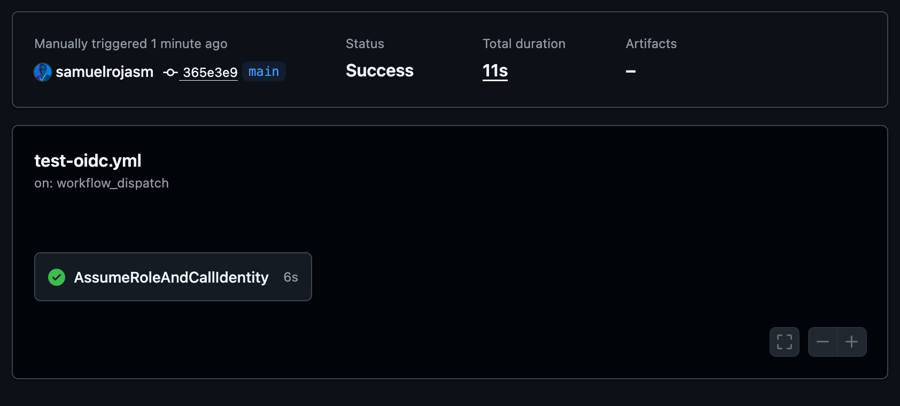
    </p>


- El Workflow de GitHub Actions definido en **`.github/workfows/test-oidc.yml`** ejecuta comandos de **AWS CLI** para validar que la conexión es exitosa.

    ```yaml
    ...
    # Commands that require AWS credentials
        - name: AWS Commands
            run: |
            aws sts get-caller-identity
            aws s3 ls
    ...
    ```

- Para ver el detalle del resultado de la ejecución, seleccione el `Job` y verifique el `step` *AWS Commands*, este mostrará la respuesta de los comandos de AWS CLI definidos en el pipeline.

    <p align="center">
        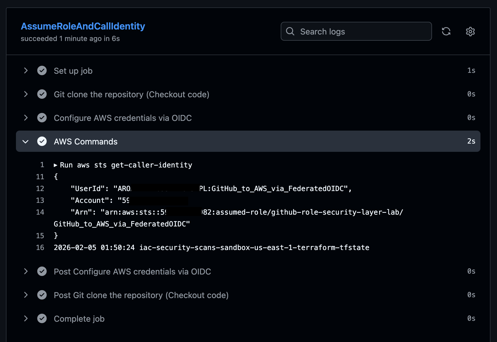
    </p>

### 2. Ejecución del análisis estático (SAST) aplicado a IaC <a name="local-08-02"></a>
- En esta sección se detallan los pasos para activar el pipeline manualmente. 
- Esta modalidad permite auditar componentes específicos de la infraestructura de forma controlada, facilitando una validación granular antes de integrar cambios definitivos.
- ¿Por qué este análisis es clave?
    - **Prevención temprana:** Realiza el escaneo de vulnerabilidades mediante herramientas SAST antes de cualquier despliegue en la nube.
    - **Reducción de riesgos:** Minimiza la probabilidad de ataques derivados de errores humanos o configuraciones inseguras.
    - **Consistencia:** Garantiza que la infraestructura sea robusta, segura y esté alineada con las mejores prácticas automatizadas.

**1. Workflow del pipeline de GitHub Actions**
- El archivo de configuración que integra las pruebas de seguridad se localiza en el directorio **`.github/workflows/test-security.yml`** de este repositorio.
- Para efectos de este ejercicio demostrativo, las pruebas se han configurado para una ejecución manual directamente desde este archivo.

**2. Ejecutar el análisis de vulenrabilidades del código de Terraform para AWS**
- Este pipeline está configurado para permitir la selección de los directorios específicos que se desean escanear. A continuación el fragmento de código de GitHub Actions en donde se define esta configuración:

    ```yaml
    ...
    ...
    workflow_dispatch: # Permite ejecución manual del pipeline
        inputs:
        scan_directory:
            description: 'Selecciona la carpeta para scaneo de Seguridad'
            type: choice
            options:
            - terraform/sandboxes/iac-security-scans/storage/s3-vulnerable
            - terraform/sandboxes/iac-security-scans/network/sg-vulnerable
            - terraform/modules/storage/s3-vulnerable
    ...
    ...
    ```

- Tras seleccionar el archivo **`.github/workflows/test-security.yml`**, haga clic en el botón **"View runs"** para dirigirse a la sección de **"Actions"**.
- Dentro de la sección **"Actions"**, localice el menú desplegable **"Run workflow"**.
- En el campo **"Selecciona la carpeta para escaneo de Seguridad"**, elija el directorio correspondiente y confirme la ejecución presionando el botón **"Run workflow"**.
- El proceso de análisis iniciará utilizando el software de seguridad definido en el pipeline.

    <p align="center">
        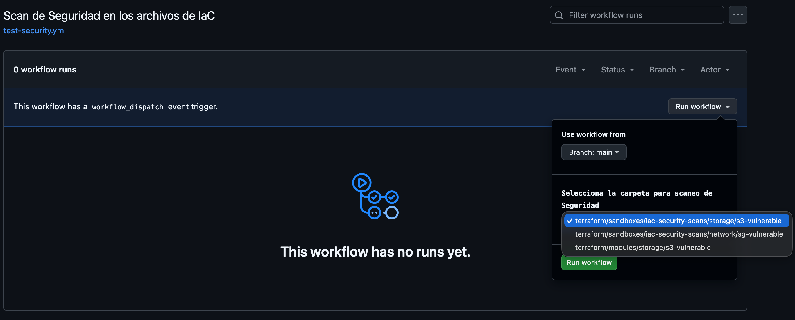
    </p>

### 3. Verificar resultados del análisis de vulenrabilidades del código de Terraform para AWS <a name="local-08-03"></a>
- En este apartado se validan los hallazgos tras la ejecución del proceso.
- El flujo de trabajo definido en **`.github/workflows/test-security.yml`** utiliza la herramienta **Checkov** para el análisis:

    ```yaml
    ...
    # --- PASO DE SEGURIDAD CON CHECKOV ---
            - name: Run Checkov Security Scan
            uses: bridgecrewio/checkov-action@master
            with:
                # Usa el input definido arriba
                directory: ${{ github.event.inputs.scan_directory }}
                framework: terraform  # all -> Escanea Terraform CloudFormation, Kubernetes
                # Generamos ambos formatos:
                output_format: cli,sarif 
                output_file_path: console,results.sarif
                soft_fail: true # Permite que el reporte se suba aunque haya fallos
    ...
    ```

- Al finalizar, el workflow debe indicar un estado exitoso (identificado con un icono de verificación en color verde).

<p align="center">
    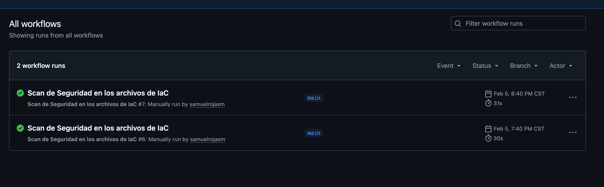
</p>

- Para visualizar el estado del **Job**, haga clic en el nombre del workflow. En la pantalla principal, la sección **Annotations** mostrará las vulnerabilidades detectadas. 
- Estos datos se extraen automáticamente del **formato SARIF (Static Analysis Results Interchange Format)** configurado en el pipeline:<br>
    - Resultados del directorio de recursos S3 (AWS):

    <p align="center">
        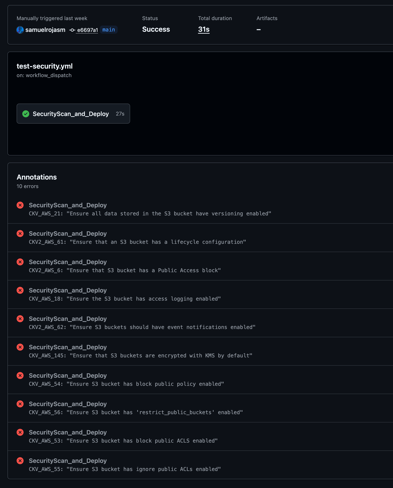
    </p>

    - Resultados del directorio de Networking (AWS):

    <p align="center">
        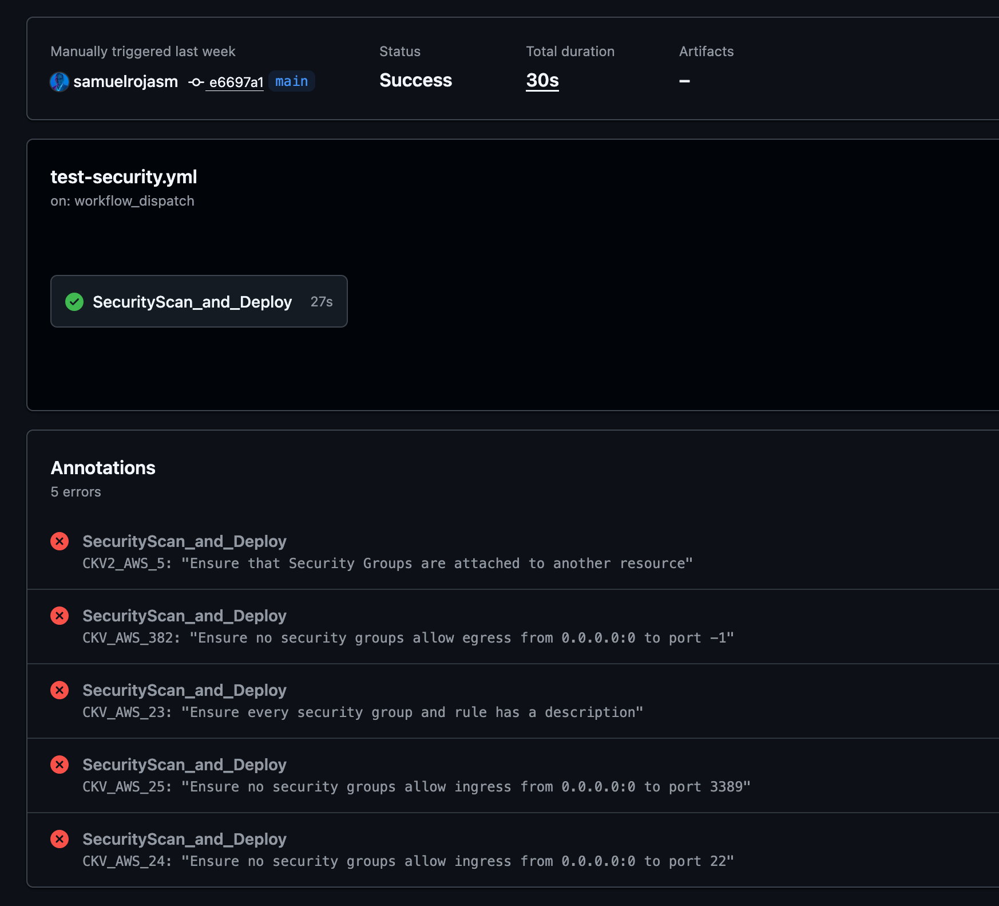
    </p>

- Para un análisis detallado, seleccione el **Job** y verifique el **step** *`Run Checkov Security Scan`*. Este mostrará la salida en **formato CLI**, detallando cada política evaluada:<br>
    - Resultados detallados (S3):

    <p align="center">
        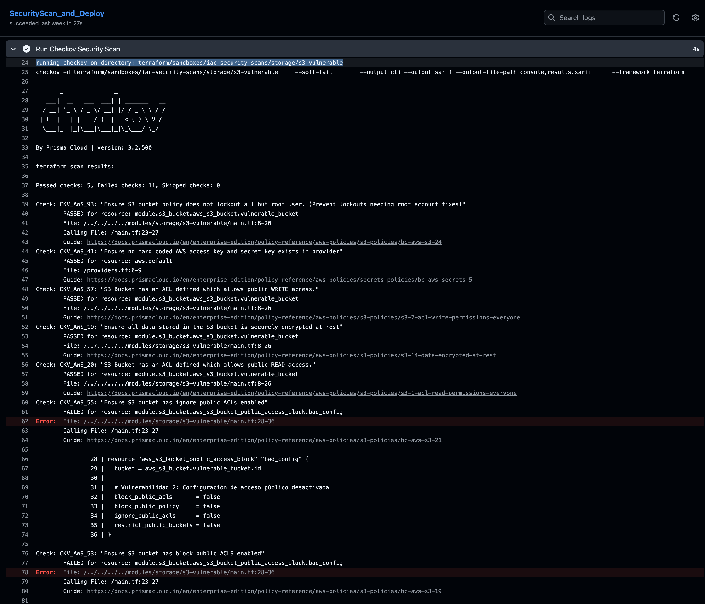
    </p>

    - Resultados detallados (Networking):

    <p align="center">
        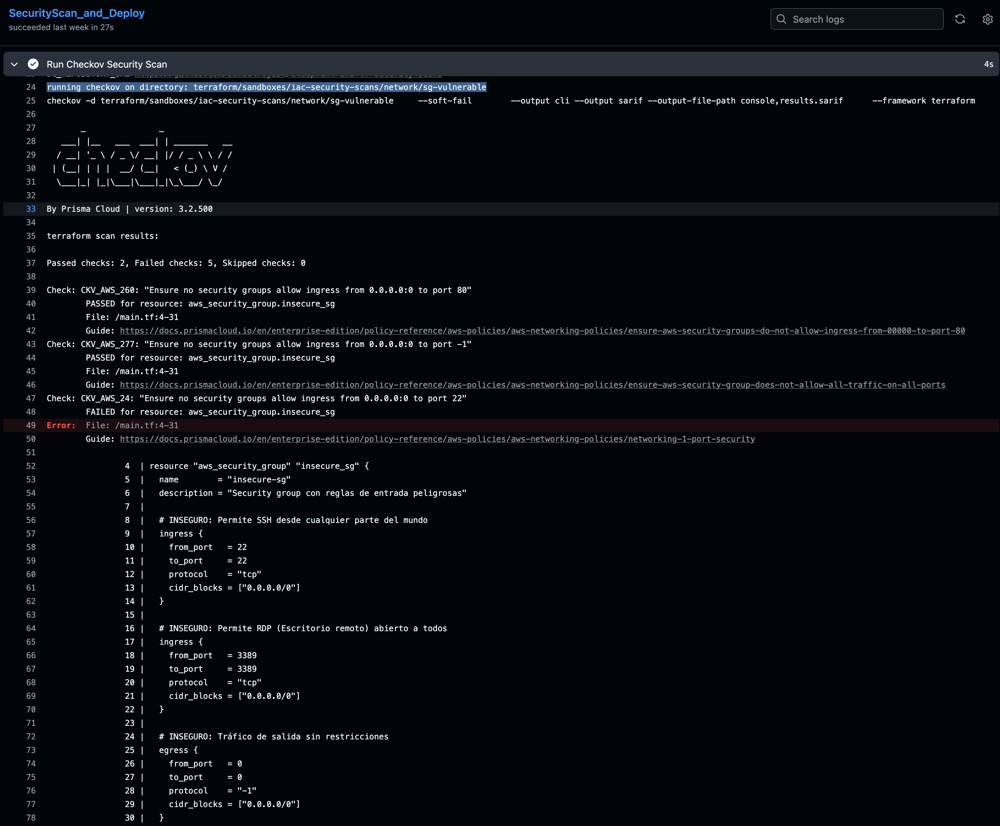
    </p>

### 4. ¿Cómo interpretar el reporte de seguridad?  <a name="local-08-04"></a>
* Cuando el pipeline falla debido a una vulnerabilidad detectada por **`Checkov`**, verás un resumen en la consola de **`GitHub Actions`** o en el  Security Summary del repositorio. Cada hallazgo incluye:<br>
    - **Check ID:** Un código único (ej. CKV_AWS_20) que identifica la política incumplida.
    - **Result:** Indica si el recurso PASSED (aprobado) o FAILED (fallido).
    - **Resource:** El nombre exacto del recurso de Terraform afectado (ej. `aws_s3_bucket.vulnerable_bucket`).
    - **File & Lines:** La ruta del archivo y el rango de líneas donde se localiza el error.
    - **Guide:** Un enlace directo a la documentación oficial con la solución recomendada.<br>

- Ejemplo de salida en consola:

    ```bash
    Check: CKV_AWS_20: "Ensure S3 bucket has versioning enabled"
        FAILED for resource: aws_s3_bucket.vulnerable_bucket
        File: /terraform/modules/storage/s3-vulnerable/main.tf:10-25
        Guide: https://docs.bridgecrew.io
    ```

### 5. Manejo de fallos en el Pipeline <a name="local-08-05"></a>
De manera predeterminada, si **`Checkov`** encuentra una vulnerabilidad de severidad alta, el pipeline devolverá un **exit code 1**, lo que detendrá el despliegue para evitar riesgos en producción.
- **Soft Fail:** Si necesitas que el pipeline continúe a pesar de los errores (por ejemplo, en una fase de pruebas inicial), puedes configurar el flag --soft-fail en el comando o en el **`Checkov`** GitHub Action.
- **Visualización SARIF:** Los resultados también se cargan en la pestaña Security > Code scanning de GitHub si el pipeline genera un archivo **`SARIF`**, permitiendo gestionar las alertas como si fueran "issues". 

> [!NOTE]
> - *`Se ha configurado soft_fail: true`* *para permitir que el pipeline finalice con éxito incluso si* *`encuentra vulnerabilidades`*.
> - *Esto facilita la visualización completa de los reportes y el* *`archivo SARIF`* *en este ejercicio demostrativo sin interrumpir el flujo de GitHub Actions*.<br>

---

### 6. Cómo omitir (Skip) reglas en el código <a name="local-08-06"></a>
- En ocasiones, una alerta de seguridad es un falso positivo o una configuración necesaria. 
- Para evitar que el pipeline falle por estos casos, puedes usar comentarios de "supresión" directamente en tu archivo .tf
- Para omitir una regla, añade un comentario con el formato `#checkov:skip=<ID_DE_REGLA>:<RAZÓN>` dentro del bloque del recurso.
- Ejemplo de supresión:
    - Si tienes un bucket de S3 que debe ser público (por ejemplo, para un sitio web estático), puedes omitir la `regla CKV_AWS_20` de la siguiente manera:

        ```hcl
        resource "aws_s3_bucket" "public_assets" {
            bucket = "mi-bucket-publico-ejemplo"

            # checkov:skip=CKV_AWS_20:Este bucket es para contenido estático público por diseño
            # checkov:skip=CKV_AWS_18:No se requiere log de acceso para este entorno de pruebas

            tags = {
                Environment = "Dev"
            }
        }
        ```

- Puntos clave:
    - **Justificación obligatoria:** Siempre incluye una descripción después de los dos puntos `(:)` para explicar por qué se omite la regla. Esto facilita las auditorías futuras.
    - **Alcance:** El comentario solo afecta al recurso donde se coloca.
    - **Múltiples reglas:** Puedes añadir varias líneas de `skip` si necesitas ignorar más de una política en el mismo recurso.
    - **Seguridad:** Úsalo con precaución; omitir reglas en producción sin una revisión previa puede exponer tu infraestructura

---

## 🔒 Guía de remediación de hallazgos <a name="local-09"></a>
Una vez identificadas las vulnerabilidades en los reportes de **Checkov**, el siguiente paso es aplicar las correcciones siguiendo las mejores prácticas de seguridad de AWS.

**1. Ejemplos comunes y cómo solucionarlos:**

|(Checkov ID)	        |Descripción	|Acción Correctiva en Terraform |
|-----------------------|---------------|-------------------------------|
|CKV_AWS_18             |El bucket de S3 no tiene habilitado el registro de acceso (Access Logging) | Añadir un bloque logging { ... } apuntando a un bucket de logs|
|CKV_AWS_144            |El bucket de S3 no tiene cifrado en reposo (KMS/AES256) | Configurar el recurso aws_s3_bucket_server_side_encryption_configuration|
|CKV_AWS_130            |Los grupos de seguridad (Security Groups) permiten tráfico entrante por el puerto 22 (SSH) desde 0.0.0.0/0 | Restringir el CIDR a una IP específica o eliminar la regla de acceso público|
|CKV_AWS_111            |La política de IAM tiene permisos de escritura excesivos (*)|Aplicar el principio de "mínimo privilegio" definiendo acciones específicas|

**2. Ciclo de mejora continua:**
- **Modificar el código:** Ajustar los archivos **`.tf`** en los directorios de S3 o Networking según las recomendaciones del formato CLI.
- **Commit y Push:** Subir los cambios a la rama correspondiente.
- **Re-escaneo:** Ejecutar nuevamente el **`workflow test-security.yml`** de forma manual.
- **Validación:** Verificar que las **Annotations** en GitHub hayan desaparecido o disminuido, confirmando que la infraestructura ahora es más segura.

---

## ⚡ Conclusiones <a name="local-10"></a>
La implementación de un análisis de seguridad automatizado sobre Infraestructura como Código (IaC) transforma la seguridad de un proceso reactivo a uno proactivo y preventivo.<br>
    * **Eficacia del "Shift Left":** Se demostró que es posible identificar configuraciones críticas (como exposición de S3 o reglas de red permisivas) antes de que representen un riesgo real en la nube de AWS.
    * **Visibilidad e Integración:** La integración de herramientas como Checkov con GitHub Actions y el formato SARIF elimina la fricción entre los equipos de Seguridad y DevOps, proporcionando feedback inmediato y visual dentro del flujo de trabajo habitual.
    * **Escalabilidad y Consistencia:** El uso de un Makefile y una estructura modular garantiza que las pruebas de seguridad sean consistentes, repetibles y fáciles de escalar a medida que la infraestructura crece.
    * **Reducción del Error Humano:** Automatizar la validación de políticas permite mantener un estándar de cumplimiento constante, minimizando las brechas de seguridad derivadas de descuidos manuales durante la fase de codificación.

---

### 📝 Licencia

Este repositorio está disponible bajo la licencia MIT.  
Puedes usar, modificar y compartir libremente el contenido, incluso con fines comerciales.  
Consulta el archivo [`LICENSE`](./LICENSE) para más detalles.

---